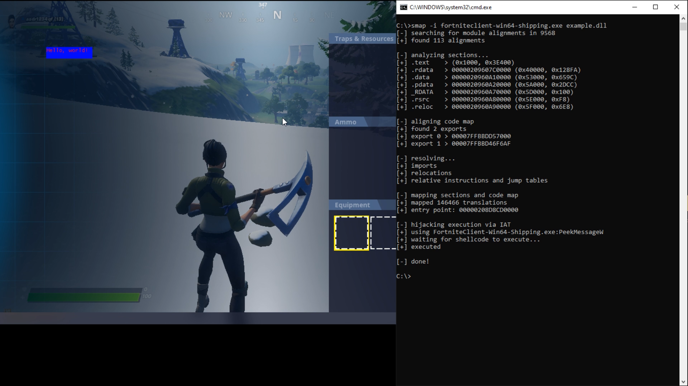
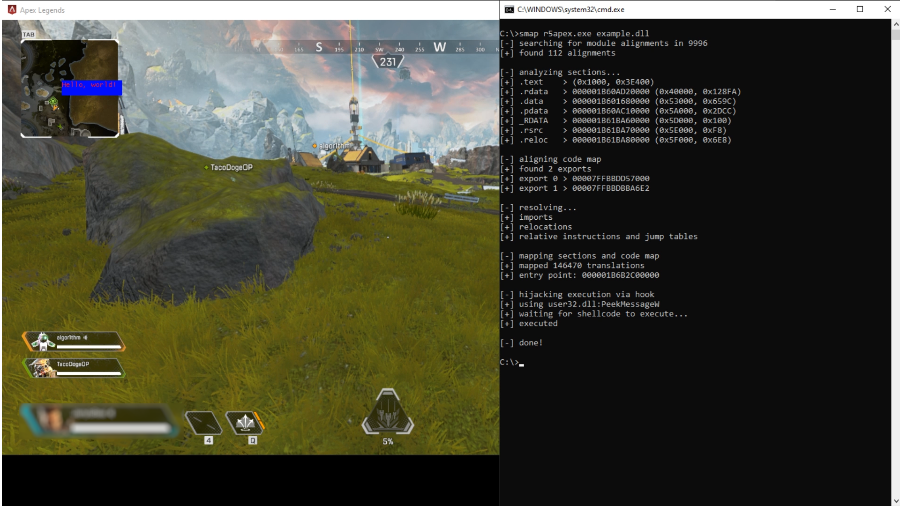

# Scatter Manual Mapper

A DLL manual mapper with two main purposes:

- Bypass heuristic and pattern detection by scattering the instructions.
- Allow hooks on protected functions by placing the hook functions (specified as an export) within existing modules.

This mapper is designed for an x64 target process and DLL.

## Procedure

1. Scan the target process for non-standard executable alignments inside modules.
2. Analyze and adjust the DLL's executable code so that it could be scattered to 1 instruction per page - change all relative instructions and jump tables so that they reference absolute addresses.
3. If the DLL has exports, then place as many instructions of the exports as possible into the found alignments. The alignments are split evenly across the exports so each export can be guaranteed to at least have its starting address in a valid module. For all other instructions, scatter them across newly allocated RX regions.
4. Hijack control flow temporarily to call the DLL's entry.

## Usage

```smap [OPTIONS] <PID|PROCESS> <DLL>```

Options:
- `-s int`
    - The threshold for scattering instructions to a new region.
    - The default is 1, so an entire page will be used for 1 instruction followed by a jump to the next.
    - For example: `-s 10000` will put 10000 instructions in a RX region before a jump to the next.
- `-i`
    - Use an IAT change to hijack control flow. 
    - By default, a temporary hook is used.
- `-m string`
    - The name of the module to use for IAT change or hook.
    - For hook, the default is `user32.dll`.
    - For IAT, the default is the process' base module.
- `-n string`
    - The target function name for hijacking control flow.
    - For hook, this is the name of the module's export to target.
    - For IAT, this is the name of the module's import to target.
    - The default is `PeekMessageW`.

## Example

The DLL used can be found in the `example` directory. It consists of a basic D3D11 hook using [MinHook](https://github.com/TsudaKageyu/minhook) and [ImGui](https://github.com/ocornut/imgui) to showcase hooks on protected functions (IDXGISwapChain::Present and IDXGISwapChain::ResizeBuffers). If you want to use this project on protected games, a bypass for RW handle access is required or consider using [access](https://github.com/btbd/access).



